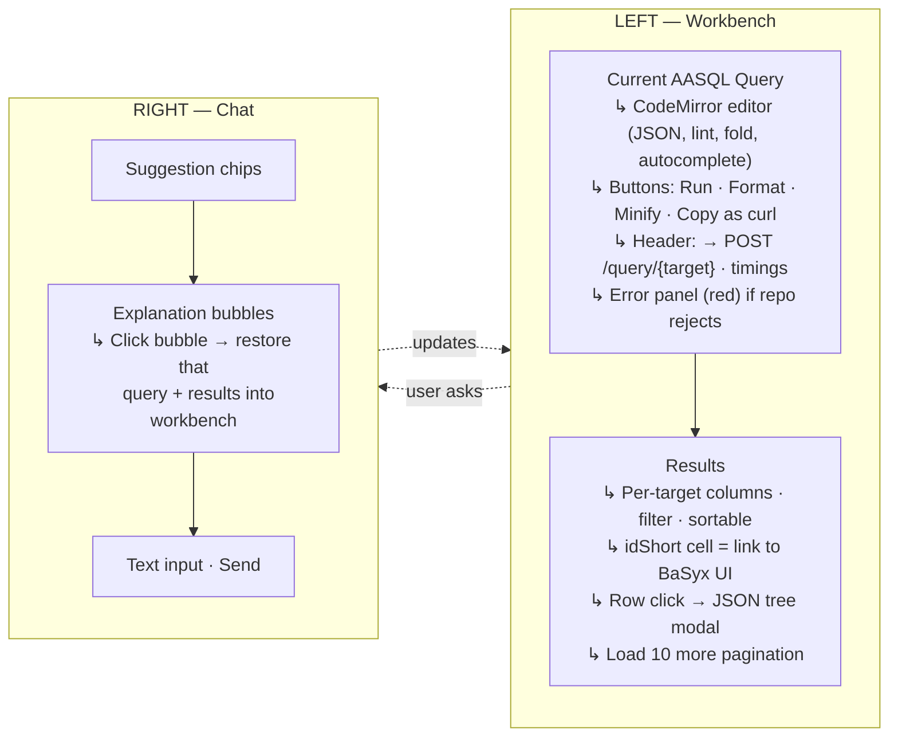
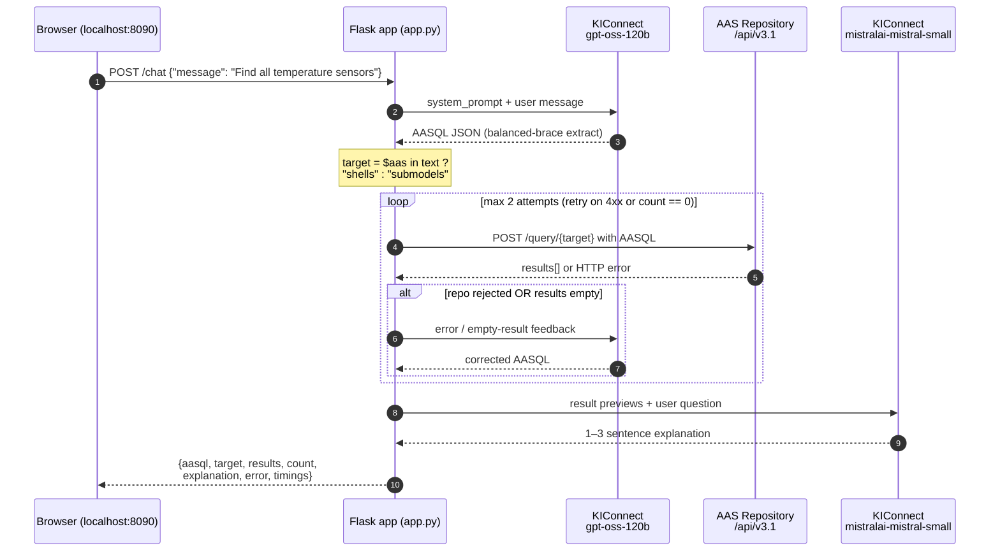
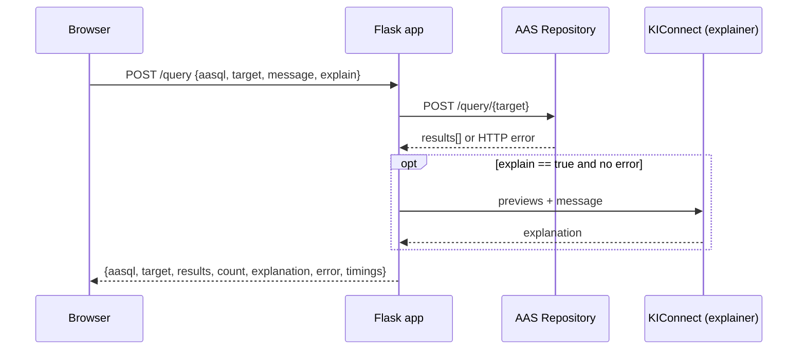
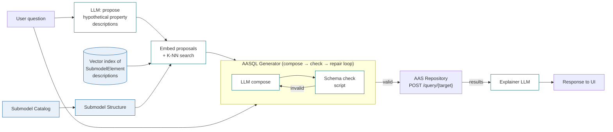
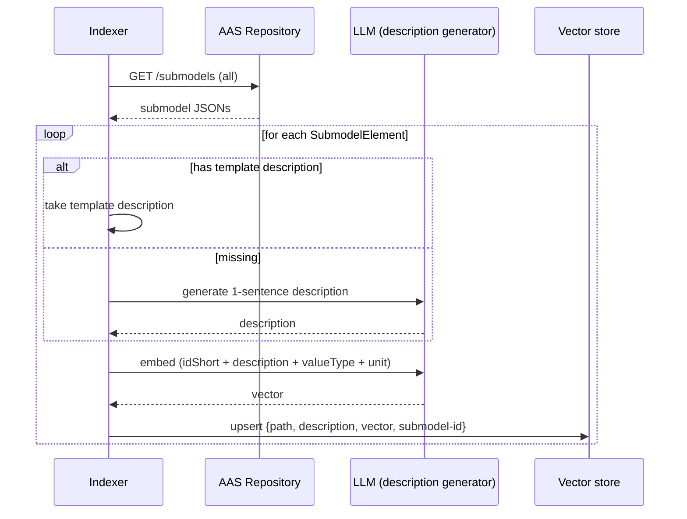

# AAS Chatbot

Natural-language search interface for the AAS Repository. Translates user questions into **AASQL** queries, executes them against the repository, and shows results plus a short LLM explanation.

Part of the [AAS Demonstrator](../README.md) — Chair of Information and Automation Systems for Process and Material Technology (IAT), RWTH Aachen University.

---

## Layout

Two-column workbench, fully visible at once:



---

## Features

### Workbench (left)

- **Editable AASQL editor** — CodeMirror with Dracula theme: JSON syntax colors, lint markers, bracket matching, code folding, auto-close brackets, autocomplete on `Ctrl-Space` (AASQL keywords)
- **Run query / Format / Minify / Copy as curl** buttons
- **Live endpoint preview** in header — `→ POST /query/{shells|submodels}` updates on every keystroke
- **Timings** in header — `LLM gen Xms · repo Yms · explain Zms · retries N`
- **Last-error panel** — repository error body surfaced verbatim (red, monospace)
- **Per-target columns** — table picks sensible columns automatically:
  - shells: `idShort / id / modelType / assetKind`
  - submodels: base + auto-detected interesting fields (`ManufacturerProductDesignation`, `CountryOfOrigin`, voltage, pressure, …)
- **Sortable headers** (▲▼) and **substring filter** input
- **idShort cell is a link** to the AAS in the BaSyx Web UI (`/aasviewer?aas=<repo-url>/shells/<base64>`)
- **Click row → modal** with collapsible **JSON tree view** + toggle to raw JSON
- **Load 10 more** pagination
- `Cmd/Ctrl-Enter` in editor also runs

### Chat (right)

- **Suggestion chips** for quick example queries
- **Markdown-rendered explanations** (1–3 sentences, grounded with inline data field previews — manufacturer, country, voltages, …)
- **Restorable bubbles** — each reply is keyed to a snapshot of `{aasql, target, results, error, timings}`; click a bubble to restore that snapshot into the workbench
- **Stateless** per turn: each `/chat` ignores prior turns

### Robustness

- **Fail-fast on missing `KICONNECT_API_KEY`** — container exits at startup
- **Retry-with-feedback loop** — if the repository rejects the query (≥400) or returns 0 results, the LLM is asked to fix/widen with the error or empty-result context fed back, up to 2 attempts
- **Balanced-brace JSON extractor** — tolerant to LLM prose, code fences, nested or sibling JSON
- **OpenAI client retry** — `max_retries=3`, `timeout=60s` on KIConnect calls
- **CORS** — permissive headers on all endpoints so the UI can run cross-origin
- **In-memory ring buffer** (200 events) + `/log.json` + `/static/log.html` debug view

---

## Architecture



For an edited re-run, the browser hits `POST /query` instead — same flow, skipping the first `L1` step.



---

## Endpoints

### `GET /`
Serves [static/index.html](static/index.html).

### `POST /chat`
NL → AASQL → execute → return all.

Request:
```json
{"message": "Find all temperature sensors"}
```

Response:
```json
{
  "aasql":   {"$condition": {...}},
  "target":  "shells",
  "results": [{...AAS objects...}],
  "count":   11,
  "explanation": "Found 11 temperature shells…",
  "error":   null,
  "timings": {"llm_gen_ms": 1460, "repo_ms": 273, "llm_explain_ms": 899, "retries": 0}
}
```

### `POST /query`
Execute an already-formed AASQL query (used by the **Run query** button).

Request:
```json
{
  "aasql":   {"$condition": {...}},
  "target":  "shells",
  "message": "Find all temperature sensors",
  "explain": true
}
```

Same response shape as `/chat`. `"explain": false` skips the summary call.

### `GET /log.json`
Returns up to 200 most recent `/chat` and `/query` events as JSON (in-memory ring buffer).

### `GET /static/log.html`
Auto-refreshing debug page that polls `/log.json` every 3s. Shows the generated AASQL, target, count, repo errors, and timings per event.

---

## Files

| File | Role |
|---|---|
| `app.py`            | Flask backend, KIConnect client, CORS, retry loop, timings, logging |
| `system_prompt.py`  | AASQL generator system prompt — schema, asset prefixes, working examples |
| `static/index.html` | Single-page UI (vanilla JS, CodeMirror, marked, Prism) |
| `static/log.html`   | Debug log viewer |
| `static/img/`       | Header logo |
| `Dockerfile`        | `python:3.12-slim` + `flask openai requests` |

---

## Configuration

| Variable | Default | Purpose |
|---|---|---|
| `KICONNECT_API_KEY` | *(required — startup fails if empty)* | API key for `https://chat.kiconnect.nrw/api/v1` (OpenAI-compatible) |
| `REPOSITORY_URL`    | `http://localhost:8081/api/v3.1` | AAS Repository (in Docker: `http://repository/api/v3.1`) |

Models (hard-coded in `app.py`):

| Constant | Model | Purpose |
|---|---|---|
| `MODEL_LARGE` | `gpt-oss-120b`                | AASQL generator |
| `MODEL_SMALL` | `mistralai-mistral-small-4-119b` | Result summariser |

---

## Running

### Standalone

```bash
export KICONNECT_API_KEY=<your-key>
export REPOSITORY_URL=http://localhost:8081/api/v3.1
pip install flask openai requests
python app.py
```

Open http://localhost:8090.

### Docker Compose

From the demonstrator root with a `.env` file containing `KICONNECT_API_KEY`:

```bash
docker compose --env-file .env up -d chatbot
```

See the [top-level README](../README.md) for the full stack.

---

## Editor shortcuts

| Key | Action |
|---|---|
| `Ctrl-Space`           | Autocomplete AASQL keywords (`$field`, `$eq`, `$sme.`, …) |
| `Ctrl/Cmd-Enter`       | Run query |
| Gutter arrow           | Fold / unfold a JSON object |

---

## Example queries

| Question | Generated AASQL (rough) |
|---|---|
| Show all temperature sensors  | `$contains` on `$aas#idShort` with `"T"` → shells |
| Find assets from Germany       | `$eq` on `$sme.CountryOfOrigin#value` = `"DE"` → submodels |
| List all pump Nameplate submodels | `$and` of `$sm#idShort = Nameplate` and `$aas#idShort contains "N"` |
| Find all Endress+Hauser devices | `$contains` on `$sme.ManufacturerProductDesignation#value` |
| Devices made by a manufacturer (MLP) | `$contains` on `$sme.ManufacturerName#value` (matches any language) |
| Submodels with an ECLASS property (any version) | `$starts-with` on `$sme.X#semanticId` with the IRDI base + `#` |

---

## AASQL capabilities (provided by neo4aas)

The repository compiles AASQL → Cypher in `neo4aas`. Recently added / relevant for query generation:

- **MultiLanguageProperty `#value` and `#language`** — querying an MLP with `#value` now works (matches any language); every operator (`$eq`, `$contains`, `$starts-with`, `$ends-with`, `$regex`, relational) applies. `#language` filters by language tag. (Previously `#value` on an MLP returned nothing.)
- **Recursive `$sme` search** — a bare `$sme` with no idShort path matches a SubmodelElement at **any depth** in the submodel tree.
- **Cross-root `$aas` + `$sm`/`$sme`** — mixing roots returns the AAS whose submodels match (scoped join, not a cartesian product).
- **`$ends-with`** and the other string operators are available.
- **Version-agnostic ECLASS / IRDI** — an ECLASS IRDI ends in `#<version>`. To match a property across ECLASS releases, query `#semanticId` with `$starts-with` on the IRDI **base + `#`** (e.g. `0173-1#02-AAO677#`). `neo4aas` also stores an indexed `target_id_base` for exact-equality discovery via its Cypher/API helpers.

---

## Known limitations

- LLM may produce structurally valid but semantically wrong AASQL. Use the editable editor + Run to fix; the retry loop also helps recover from repo errors and empty results.
- No conversation memory across `/chat` calls — workflow relies on the workbench + clickable bubble snapshots to navigate history.
- BaSyx UI deep-link assumes the UI at `http://localhost:3000/aasviewer` and the repo public URL at `http://localhost:8081/api/v3.1` (constants in `static/index.html`).

---

## Roadmap: skill-based query generation

Today the chatbot relies on a single hand-written system prompt that bakes in the schema of three known submodels (`Nameplate`, `TechnicalData`, `HierarchicalStructures`). That works for the lab demo but does not scale:

- New submodel types (manufacturer AAS, AID/AIMC, custom IDTA templates) need the prompt to be edited by hand.
- The model has no awareness of which `TechnicalData` properties actually exist on a given asset class.
- Free-text questions about specific physical properties ("pumps that handle more than 5 bar") cannot be answered reliably without grounding in real field names.

The plan is to refactor the AASQL generator into a small set of cooperating **skills**, each with a single responsibility, orchestrated by a thin agent loop. The current monolithic `_generate_aasql` becomes the **AASQL Generator** skill; everything else feeds it grounded context.

### Skills

| Skill | Responsibility | Inputs | Outputs |
|---|---|---|---|
| **Submodel Catalog** | Knows which submodel types exist in the repo and their high-level purpose. Backed by IDTA template metadata + a periodic scan of the repo's submodel index. | repo URL | catalog: `{idShort, semanticId, description, asset-class-coverage}` |
| **Submodel Structure** | For a chosen submodel, lists every `SubmodelElement` with its `idShort`, type, unit, valueType, and any template description. Provides depth-N path resolution so AASQL `$sme.A.B.C#value` paths are real. | submodel id or semanticId | tree of `{path, modelType, valueType, semanticId, description}` |
| **Embeddings-based Retrieval (HyDE-style)** | At **index time**: for each `SubmodelElement` in the catalog, compute a short text description (from the template or LLM-generated) and embed it into a vector store. At **query time**: first ask the LLM to propose a small list of *hypothetical property descriptions* that would help answer the user question (e.g. for "pumps that handle high pressure" → `"maximum operating pressure of a pump"`, `"rated pressure"`, `"pressure class"`). Embed each proposed description and run K-NN search against the index. Union the top-K hits as the retrieved context. This bridges the vocabulary gap between user wording and template field names better than embedding the raw question. | user question | top-K SubmodelElement paths with descriptions |
| **AASQL Generator** | End-to-end producer of a valid AASQL query. Internally runs three steps in a loop until valid or retry budget is spent: (a) **LLM compose** — generates AASQL JSON from user question + retrieved structural context, with knowledge of AASQL grammar, operators, root prefixes (`$aas`, `$sm`, `$sme`) and value-type rules; (b) **Schema check (script)** — pure-Python validator that confirms JSON well-formedness, required keys (`$condition`, operator arity), field paths against real `SubmodelElement` paths from the **Submodel Structure** skill, and value-type compatibility; (c) **Repair** — if invalid, feeds the structured errors back to the LLM and regenerates. Returns either a verified AASQL JSON or the final failure with all error traces. | user question, retrieved paths | AASQL JSON, validation status |

### Pipeline



### Indexing step (offline / on repo change)



### Acceptance criteria

- A new submodel type can be added to the repo and become queryable **without editing the chatbot codebase** — only the catalog/index needs to be refreshed.
- Questions involving physical quantities ("pumps with rated power above 3 kW") generate AASQL referencing the real field paths returned by the retrieval skill, not best-guess names.
- The **AASQL Schema Checker** catches at least these classes of error locally (before hitting the repo): unknown field path, wrong root prefix, operator/arity mismatch, value-type mismatch.
- End-to-end latency stays within ~2× the current single-LLM-call baseline, by caching the catalog/structure and keeping retrieval to a single vector lookup per question.
